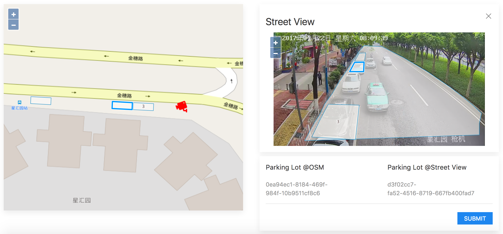

# parking-lot-identification

This tool is used to create mapping of parking lots between OSM and street view.



* Map view is supported by [OpenLayers](https://github.com/openlayers/openlayers)
* Front-end framework is supported by [UIKit](https://github.com/uikit/uikit)
* DB is supported by [Mongoose](https://github.com/Automattic/mongoose)
* Internationalization is supported by [i18next](https://github.com/i18next/i18next)
* Virtual addresses of SPA is supported by [jQuery Address plugin](https://github.com/asual/jquery-address)

## Installation

1. Clone this repository and goto project directory.

2. Build app image.

	2.1. Use default context path ( / ).
	
	```
	$ docker-compose build
	```
	
	2.2. *( Optional )* build dashboard image with special context path.
	
	```
	$ docker-compose build --build-arg context=/parking dashboard
	```

3. Start my app.

	3.1. Use default config.
	
	```
	$ docker-compose up -d
	```
	
	3.2. *( Optional )* startup with special config.
	
	```
	$ export EMap_API=http://emap.crl.ibm.com/imd/api/
	$ export Street_View_APIKEY=car
	$ export MongoDB_URI=mongodb://dashboard_mongo:27017/parking_lots_identification
	$ docker-compose up -d
	```

4. Access url:  [http://localhost:8080](http://localhost:8080)

## Maintenance

1. Stop my app.

	```
	$ docker-compose stop
	```

2. Remove my app containers.

	```
	$ docker-compose rm -f
	```